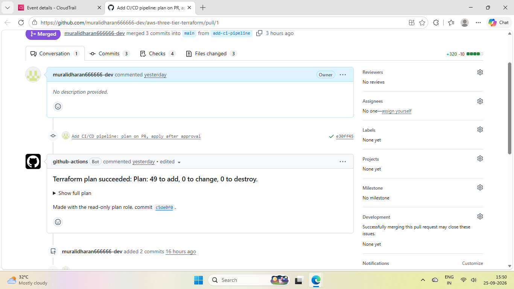
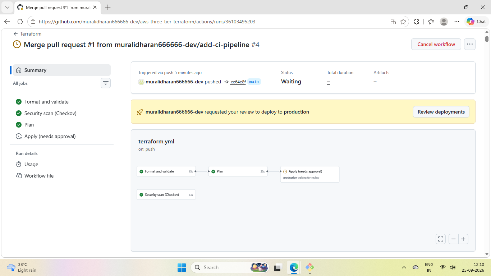
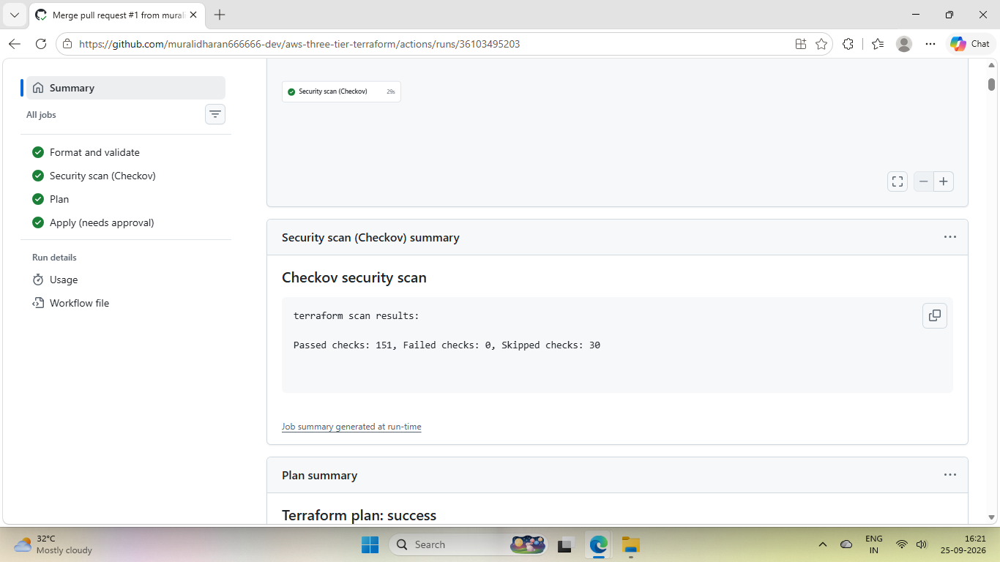
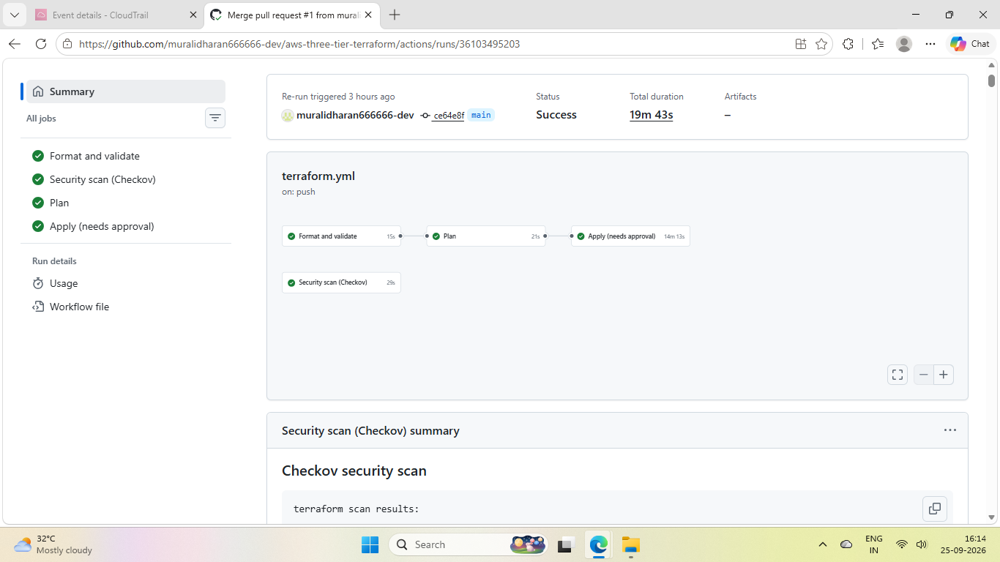
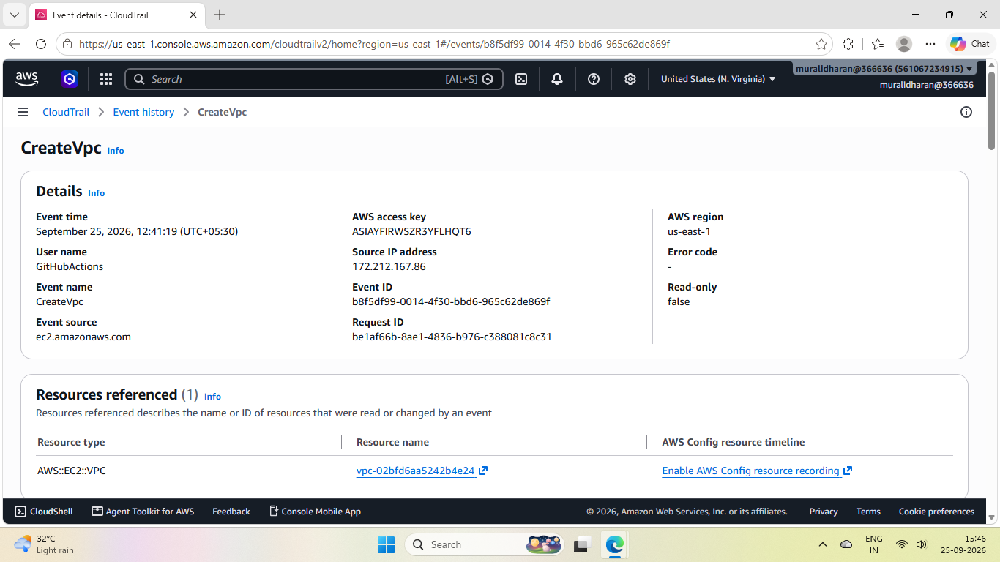

# CI/CD pipeline: the details

The short version is in the [README](README.md#cicd-pipeline). This is the longer write-up.

This used to be in my Known gaps. I was running `terraform apply` from my laptop, which works for one person, but nothing ever got reviewed. So I added a GitHub Actions pipeline. I don't run apply myself anymore.

## What runs when

On a pull request:
- `terraform fmt -check` and `terraform validate`
- Checkov security scan
- `terraform plan` with a read-only role, and the plan gets posted as a comment on the PR

On merge to `main`, the same checks and plan run again, then the apply job stops and waits. It runs in a GitHub Environment called `production` with me as the required reviewer, so nothing changes in AWS until I approve it. Only `main` is allowed into that environment, and I turned off the admin bypass, so I can't skip it either.

Plan runs on every PR because it can't break anything. It only reads. Apply changes real infrastructure, so it waits until the code is merged and someone has actually read the plan.

## No AWS keys in GitHub

GitHub logs in to AWS with OIDC. Each run gets temporary credentials that expire after an hour, so there's nothing stored that could leak.

Two roles, not one:

- `github-terraform-plan` has `ReadOnlyAccess`, plus write/delete on the one state lock file and read on the one DB secret. Plan takes the lock and refreshes the secret, so it needs those two and nothing else. PRs and `main` can use it.
- `github-terraform-apply` has admin. Only a job running in the `production` environment can assume it.

Why split them: plan runs automatically on every PR, before anyone has looked at the code. If that role could write, a bad PR could change AWS with nobody approving it. With a read-only role it just can't.

Read-only doesn't mean it can't see anything though. The plan role can read state, and state has the DB password in it. That's why I scoped its extras to one lock file and one secret, not every secret in the account.

Why admin on the apply role: the stack creates IAM roles, and anything that can create IAM roles can give itself more permissions anyway. A narrow policy wouldn't protect much. The real control is who can assume it.

The roles are in a separate `bootstrap/` folder that I applied once from my laptop. The pipeline can't create the roles it logs in with, and keeping them out of the main stack means `terraform destroy` can't delete them.

## Security scan

I went with Checkov over tfsec. The tfsec repo says it's now part of Trivy and new work is going there, so I didn't want to start on it.

First run: 141 passed, 39 failed. I fixed 9 of them:
- EC2s require IMDSv2 (with v1, an SSRF bug in the app could read the instance role's credentials)
- public subnets don't auto-assign public IPs anymore (2 findings)
- the DB security group has no outbound rules at all
- the ALB drops invalid headers
- RDS copies tags to snapshots
- CloudTrail covers all regions, not just us-east-1
- CloudTrail logs expire after 90 days
- the VPC's default security group is locked down

The other 30 I left. Most need a domain name (HTTPS), cost money I don't want to spend on a test stack (WAF, KMS keys, a year of log retention), or would stop `terraform destroy` from working (deletion protection). Each one has a `#checkov:skip` comment on the resource with the reason, so it's written down in the code. Then I took `--soft-fail` off. Now it's 151 passed, 0 failed, 30 skipped, and any new finding fails the PR.

## Testing it

The stack was destroyed when I built this, so the plan said 49 to add (the 47 from before, plus 2 new resources from the security fixes). I didn't want to pay just to test the gate, so the first time I merged, let it pause, and rejected it. Nothing got built.

Then I re-ran it and approved. 49 resources in about 14 minutes, and RDS was 13m35s of that. The app loaded through the ALB. In CloudTrail, `CreateVpc` shows up under the `github-terraform-apply` role, not my IAM user. Then I destroyed it straight away.

## Two things that tripped me up

My `.gitignore` had `.terraform.lock.hcl` in it, so the lock file never got committed. Without it, CI downloads whatever the newest allowed AWS provider is, not the v5.100.0 I'd been testing with. I took it out of `.gitignore`, committed it, and ran `terraform providers lock` with `-platform=linux_amd64` as well, because I'm on Windows and the runners are Linux.

A GitHub OIDC provider already existed in my account from an earlier project, and another role still uses it. You can only have one per URL in an account, so creating it again would have failed, same kind of thing as Problem 3. The bootstrap looks it up with a `data` block instead. That also means destroying the bootstrap folder can't delete it from under the other project.
