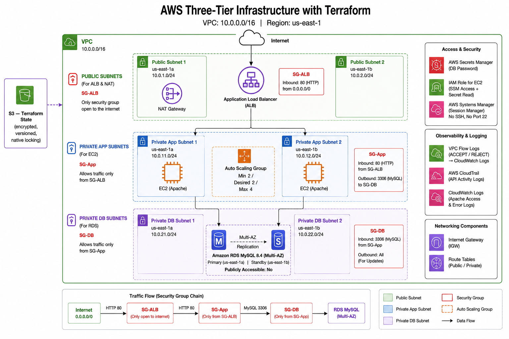
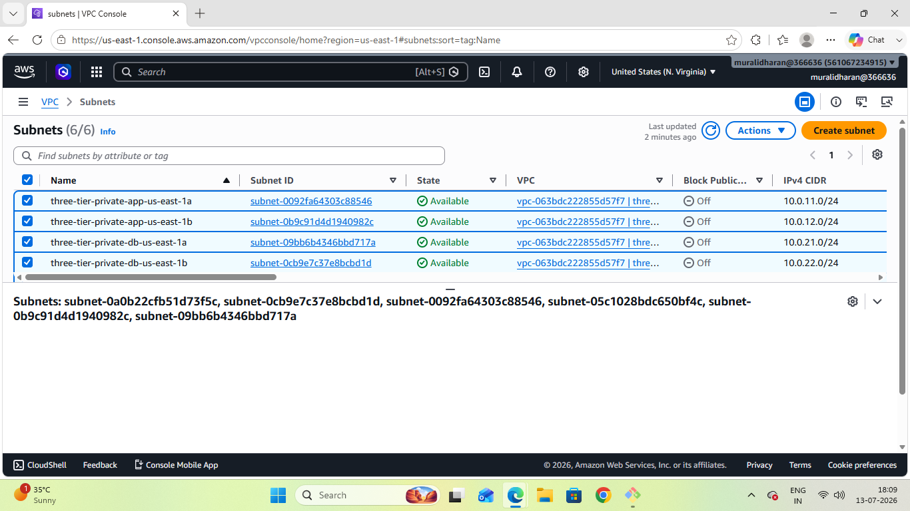
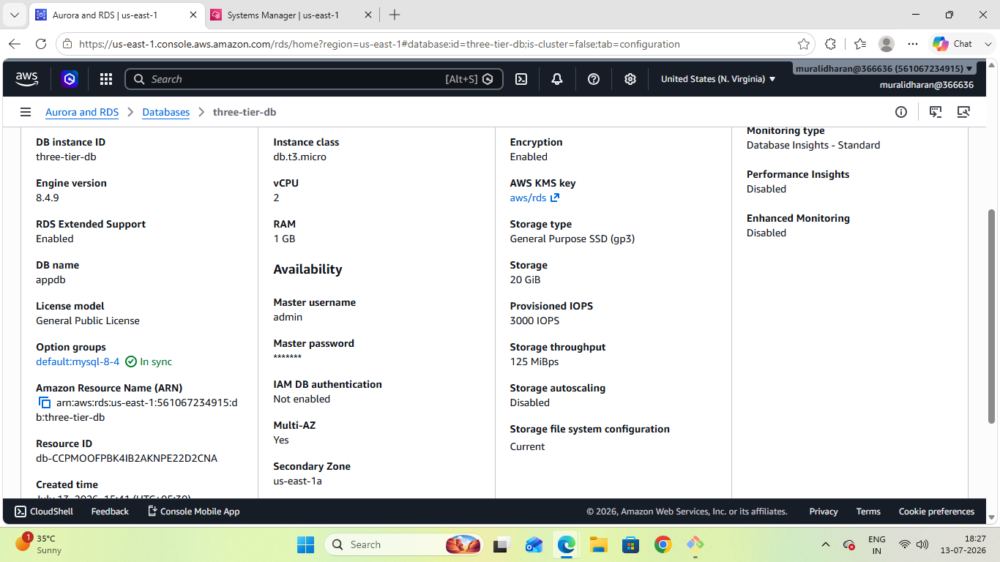
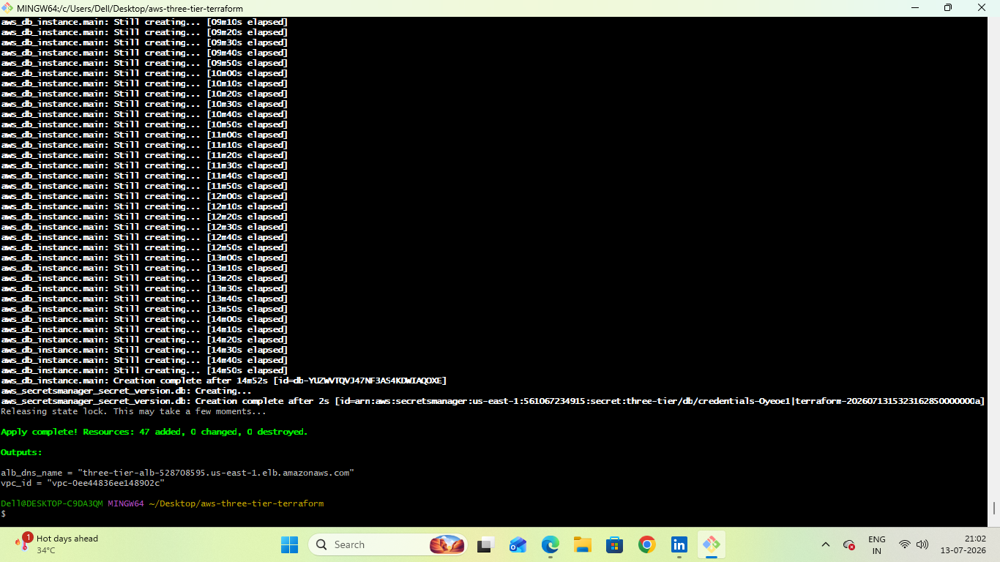
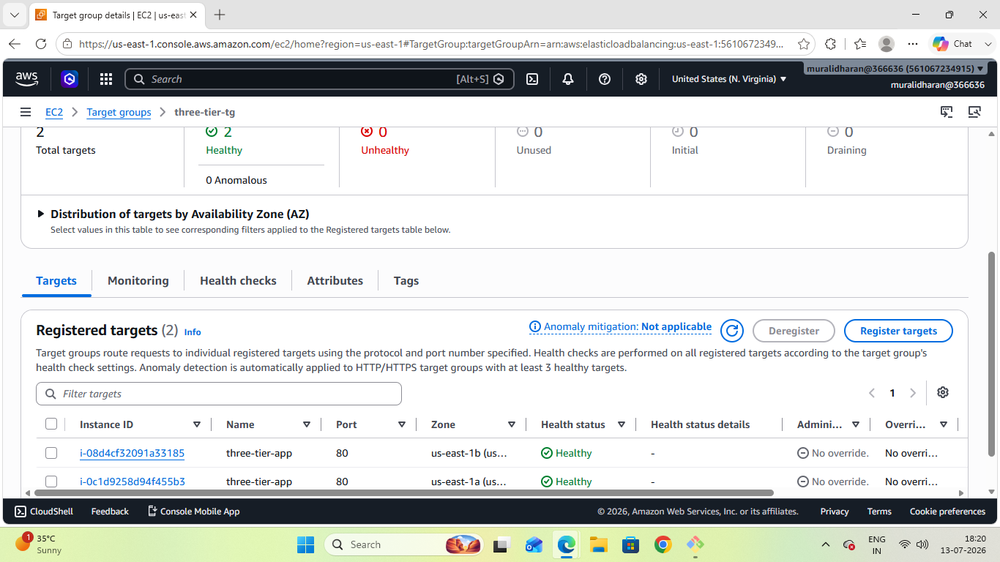
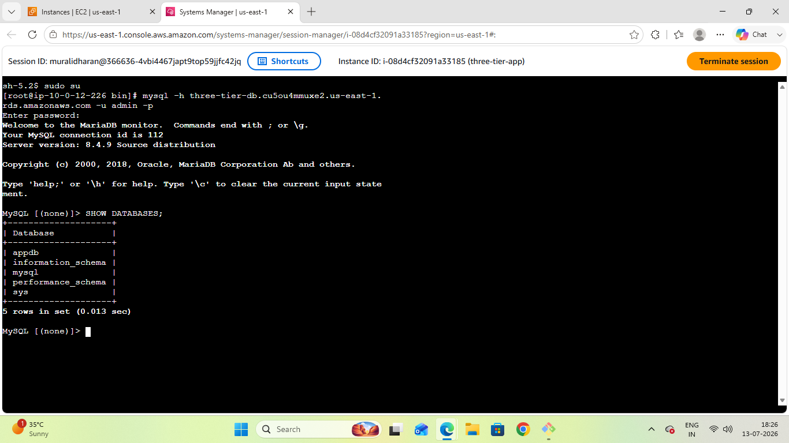
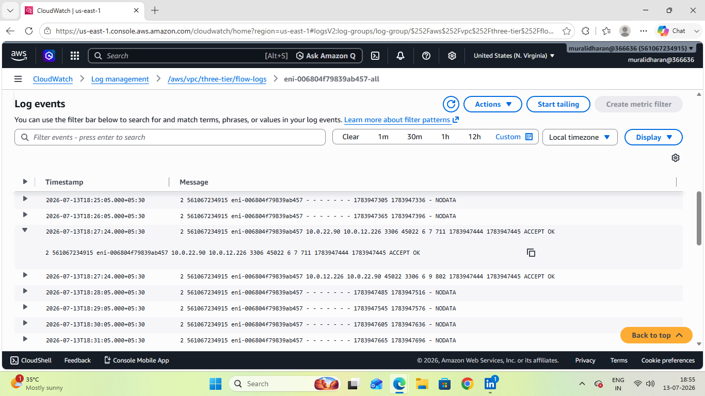

# AWS Three-Tier Infrastructure with Terraform

## Why I built this

I'd already built this same three-tier setup by hand in the AWS console. It worked in the end, but it broke twice on the way — the ALB kept returning 502 because the wrong security group got attached, and I couldn't install a MySQL client because Amazon Linux 2023 doesn't have a `mysql` package.

I fixed both by hand. Then I wanted to rebuild the whole thing in Terraform, mainly so those two mistakes couldn't happen again.

Took me about two days. Ended up with 47 AWS resources managed as code, and I can destroy the whole thing and rebuild it in about 15 minutes with one command. Hit three more problems I hadn't seen before — those are written up below too.

Manual console version: [aws-three-tier-web-application](https://github.com/muralidharan666666-dev/aws-three-tier-web-application)

---

## What I built

Same architecture as the manual version, but everything is code now:

- Custom VPC, 10.0.0.0/16, 6 subnets across us-east-1a and us-east-1b
- EC2 running Apache in private subnets, behind an Auto Scaling Group
- Application Load Balancer in the public subnets
- RDS MySQL 8.4 Multi-AZ in the private DB subnets
- Session Manager instead of SSH — no port 22 open anywhere
- Password generated by Terraform and stored in Secrets Manager. I don't know what it is.
- VPC Flow Logs, CloudTrail, and Apache logs shipped to CloudWatch

---

## Architecture



```
Internet
   │
   ▼  SG-ALB   (the only security group open to the world)
ALB — public subnets, 2 AZs
   │
   ▼  SG-App   (only accepts traffic from SG-ALB)
EC2 × 2-4 — private subnets, Auto Scaling Group
   │
   ▼  SG-DB    (only accepts traffic from SG-App)
RDS MySQL 8.4 Multi-AZ — private subnets, publicly accessible: no
```

The database has no path from the internet. Not because a firewall rule blocks it — because no route exists.

---

## Services used

| Service | How I used it |
|---------|--------------|
| Amazon VPC | 10.0.0.0/16, 6 subnets, IGW, NAT gateway, route tables |
| Amazon EC2 | Launch template — AL2023, Apache, SSM agent, mariadb105 |
| EC2 Auto Scaling | Min 2 / Desired 2 / Max 4, CPU target 70%, ELB health checks |
| Application Load Balancer | Public subnets, target group, HTTP listener |
| Amazon RDS MySQL 8.4 | Multi-AZ, db.t3.micro, encrypted, private subnets |
| Security Groups | 3 groups chained — each one only accepts traffic from the one above it |
| NAT Gateway | 1 in a public subnet (only 1, to save cost) |
| IAM | EC2 role for Session Manager, plus read access on one secret |
| Secrets Manager | DB password, generated by Terraform, never in the code |
| Systems Manager | Session Manager — no SSH keys, no port 22 |
| VPC Flow Logs | Every connection, ACCEPT or REJECT, into CloudWatch |
| CloudTrail | API audit trail |
| CloudWatch | Apache access and error logs shipped off the instances |

---

## Network layout

| Subnet | AZ | CIDR | Used for |
|--------|-----|------|----------|
| Public Subnet 1 | us-east-1a | 10.0.1.0/24 | ALB + NAT Gateway |
| Public Subnet 2 | us-east-1b | 10.0.2.0/24 | ALB |
| Private App Subnet 1 | us-east-1a | 10.0.11.0/24 | EC2 |
| Private App Subnet 2 | us-east-1b | 10.0.12.0/24 | EC2 |
| Private DB Subnet 1 | us-east-1a | 10.0.21.0/24 | RDS primary |
| Private DB Subnet 2 | us-east-1b | 10.0.22.0/24 | RDS standby |

None of that is hardcoded in the resource blocks. It all comes from variables:

```hcl
variable "availability_zones" {
  default = ["us-east-1a", "us-east-1b"]
}

variable "public_subnet_cidrs" {
  default = ["10.0.1.0/24", "10.0.2.0/24"]
}
```

The subnet resource uses `count = length(var.public_subnet_cidrs)`. Add a third AZ and a third CIDR to those lists and you get a third subnet — without touching a single resource block. That's the bit that actually matters about doing this as code.



---

## Auto Scaling config

| Setting | Value |
|---------|-------|
| Min / Desired / Max | 2 / 2 / 4 |
| Scale trigger | CPU target 70% |
| Health check type | ELB, not EC2 |

Used ELB health checks rather than the default EC2 ones. With EC2, Apache could die and the ASG would happily keep a running instance that serves nothing, because the box itself is still up. With ELB, the ASG goes by the load balancer's verdict — is this thing actually serving HTTP?

---

## Database config

- Engine: MySQL 8.4.9
- Instance: db.t3.micro
- Multi-AZ: yes, standby in the second AZ
- Public access: no
- Storage encrypted: yes
- Password: generated by Terraform, written to Secrets Manager

I don't know the database password. Terraform generates 24 random characters, hands them to RDS, and writes them into Secrets Manager. The app reads it at runtime through its IAM role. It's never in the code and it isn't in this repo.



---

## How I set it up

**Remote state first.** State goes in an S3 bucket, encrypted and versioned, with locking on. That bucket has to be created by hand before Terraform can run at all — Terraform can't create the bucket that holds its own state. Bit of a chicken and egg thing. One-time manual step.

**Networking** — VPC, 6 subnets, IGW, NAT gateway, route tables. 18 resources, took 2m39s. Plan predicted exactly 18 before I applied anything, which matched what I'd counted by hand.

**Security groups** — the 3-layer chain. Each SG points at the one above it by ID rather than by IP range. More on why below.

**Compute** — launch template, ALB, target group, ASG, scaling policy. Created the ALB explicitly in code rather than letting the ASG make it, same reason as the manual build.

**Data + access** — RDS Multi-AZ, IAM role for Session Manager, Secrets Manager. RDS took 16 minutes on its own.

**Observability** — VPC Flow Logs, CloudTrail, CloudWatch agent for the Apache logs. Added this last, though it probably should have been earlier.

**Then destroyed everything and rebuilt it** to check it actually worked.



All 47 resources back in 15 minutes 36 seconds. New ALB DNS, new VPC ID, new database password — identical configuration. Zero console clicks.

---

## Problems I ran into

### Problem 1 — the 502 from the manual build, and why it can't happen now

In the console build I let the ASG auto-create the load balancer, and AWS attached SG-App to the ALB instead of SG-ALB. Every target went Unhealthy. I checked Apache, checked route tables, checked SG-App's rules — all fine. The problem was which SG was *attached* to the ALB, and in the console that's a completely different screen from where you write the SG rules.

In Terraform it's all in one file:

```hcl
resource "aws_security_group" "app" {
  ingress {
    security_groups = [aws_security_group.alb.id]   # only the ALB can talk to me
  }
}

resource "aws_lb" "main" {
  security_groups = [aws_security_group.alb.id]     # the ALB says what it wears
}
```

The ALB can't exist without naming its security group — it's a required argument. If I put SG-App there instead, SG-App's own ingress rule would be pointing at a security group that nothing is wearing. The chain visibly doesn't connect, in the code, before anything gets deployed.



Both targets came up healthy on the first apply. This is the exact screen that showed everything Unhealthy in the manual build. No 502, nothing to debug.

---

### Problem 2 — mariadb105, now baked in

Same issue as the manual build. `dnf install mysql` fails on Amazon Linux 2023 with `No match for argument: mysql`. The MySQL-compatible client on AL2023 is `mariadb105`.

That's now in the launch template's user data:

```bash
# AL2023 has NO 'mysql' package. dnf install mysql fails with
# "No match for argument: mysql". The client is mariadb105.
dnf install -y mariadb105
```

Every instance the ASG launches gets it on first boot. Solved it once, permanently — never had to think about it again during this build.



That one screenshot covers a lot: Session Manager connected me to a private EC2 with no SSH key and no port 22 open, the instance read the DB password from Secrets Manager using its IAM role, the SG-App to SG-DB chain let the connection through, and `mysql` was already installed because the launch template put it there.

Also added `set -e` to the script. Without it, if a package install fails the script just carries on, and the instance boots "successfully" with no web server. Then the health check fails and there's nothing obvious to point at.

---

### Problem 3 — DB subnet group already existed

```
Error: creating RDS DB Subnet Group (three-tier-db-subnet-group):
DBSubnetGroupAlreadyExists
```

Turned out I still had a DB subnet group with the same name sitting in the account from the manual build. It existed in AWS but wasn't in any state file — an orphan that nothing was managing.

Two options: delete it, or use `terraform import` to pull it into state. I deleted it, because I wanted the stack fully owned by Terraform and the orphan had no reason to survive. But `import` is the right answer when you can't delete something — a production database, for instance.

Also learned Terraform doesn't roll back when it fails. The 8 resources it had already created stayed created and were recorded in state. Re-running apply just picked up where it stopped.

---

### Problem 4 — Terraform said it worked, but the running instances hadn't caught up

Added the IAM instance profile to the launch template. Terraform said `Modifications complete`. Session Manager still wouldn't connect:

```
DHMC is not enabled and IAM instance profile is not attached
Ping status: Offline
```

A launch template is only a blueprint. Changing it affects instances created *after* that point. The two already running were launched from the old version and still had no IAM role.

Terraform wasn't lying — it had updated the template. But nothing told the ASG to cycle its instances onto the new one.

Fixed it with an instance refresh:

```hcl
instance_refresh {
  strategy = "Rolling"
  preferences {
    min_healthy_percentage = 50
  }
}
```

Now a template change triggers a rolling replacement automatically, keeping half the fleet up during the swap.

Lesson: "Terraform said it worked" is not the same as "the running fleet reflects it."

---

### Problem 5 — SSM agent missing, because my AMI filter was sloppy

Freshly launched instance. Session Manager showing `Ping status: Offline`, `Last ping time: —`. But this time the IAM role *was* attached, so it wasn't the same problem as before.

Pulled the EC2 system log. The user data had completed cleanly — Apache installed, mariadb105 installed, no errors, cloud-init finished in 44 seconds. So the instance clearly had working internet through the NAT gateway.

Then I grepped the log for `ssm`. Nothing at all. Not starting, not failing — the agent just wasn't on the box.

My AMI filter was:

```hcl
values = ["al2023-ami-*-x86_64"]
```

That wildcard also matches `al2023-ami-minimal-*`, and the minimal AL2023 image ships without the SSM agent. With `most_recent = true`, Terraform had quietly picked it.

Two fixes: tightened the filter to the standard variant only, and installed `amazon-ssm-agent` explicitly in user data so it doesn't depend on which image comes back.

The thing worth noting about this one is that the log said the script *succeeded*. It was the absence of any SSM lines that told me what was wrong. Nothing errored.

---

## Observability, and why I care about it now

VPC Flow Logs record every connection inside the VPC — source, destination, port, and whether it was ACCEPT or REJECT.



Here's the thing. My 502 in the manual build happened because the ALB couldn't reach the instances — wrong security group. With Flow Logs on, that would have shown up as a REJECT on port 80 from the ALB's IP. **Thirty seconds to find, instead of the half hour I spent checking Apache, then route tables, then SG rules, one at a time.**

I had no logging at all in the manual build. That's why the debugging took as long as it did.

The Apache access logs are shipped to CloudWatch too, which means they survive the instance being terminated. The ASG replaces instances routinely — without this, a failed request from twenty minutes ago on an instance that no longer exists is unrecoverable.

CloudTrail records every AWS API call, so "who deleted the database" has an answer.

---

## Decisions I made, and what I gave up

**Remote state on S3.** Local state is fine on one laptop. It falls apart as soon as a second person or a pipeline runs Terraform — two applies at once silently overwrite each other's record of what exists, and a lost state file means AWS resources you can't destroy any more. The cost is that the bucket has to be created by hand first.

Every tutorial says to use a DynamoDB table for locking. I did, then Terraform 1.15 warned me `dynamodb_table` is deprecated because S3 now does conditional writes natively. Switched to `use_lockfile`. One less resource to manage. But most existing codebases still use DynamoDB, so I made sure I understood both.

**Security groups reference each other, not IP ranges.** `security_groups = [aws_security_group.alb.id]` is an identity, not an address. The ALB's IP changes as AWS scales it — a CIDR rule would silently break. And every EC2 the ASG launches automatically gets SG-App, so it's covered the moment it exists.

**Flat files, no modules.** Modules are for reusing code across environments. I've got one environment. Modules would just mean jumping between more files to trace a single resource. If I add staging later I'll have to refactor, which is fine.

**`default_tags` on the provider.** Every resource gets `ManagedBy = Terraform` automatically. Right after the first apply I briefly saw 2 VPCs and 12 subnets in the console — my old manual build sitting alongside the Terraform one. That tag was the only reliable way to tell them apart.

---

## Rough cost breakdown

| Resource | Approx monthly cost |
|----------|-------------------|
| EC2 t2.micro x2 | Free tier |
| RDS db.t3.micro Multi-AZ | ~$25–50 |
| NAT Gateway | ~$32 |
| ALB | ~$16 |
| S3 state + lock | Basically free |

RDS and NAT Gateway charge even when idle, so `terraform destroy` after testing.

---

## Running it

```bash
terraform init
terraform plan
terraform apply
```

You'll need an S3 bucket for state (created by hand, chicken and egg) and AWS credentials set up.

`terraform output alb_dns_name` gives you the URL.

Type `http://` explicitly. The listener is HTTP-only and browsers silently upgrade to HTTPS, which just times out because nothing is listening on 443. Wasted a few minutes on that the first time.

---

## Known gaps

Stuff production would need that this doesn't have. I know these are missing — they're all choices, not oversights.

**No HTTPS.** The ALB only listens on port 80, so traffic between a browser and the load balancer is plaintext. Anyone on the network path can read it. HTTPS needs a domain name I'd have to buy, plus an ACM certificate, and I didn't want to spend on that for a portfolio project. This is the one I'd add first.

**No deletion protection on RDS.** I set `deletion_protection = false` and `skip_final_snapshot = true` so `terraform destroy` would actually work while I was testing. As it stands, if someone deleted the `aws_db_instance` block and ran apply, the database would just be gone — no confirmation, no backup. In production both would be the other way round, plus a `prevent_destroy` lifecycle rule so Terraform itself refuses. It's deliberate but it's the first thing anyone reviewing this would point at.

**No CI.** I run `terraform apply` from my laptop. For one person on one project that's honestly fine. It breaks down when two people can both apply, when nobody's reviewing a change that says `1 to destroy` on the production database, and when there's no record of who applied what.

The way it should work is: open a pull request, CI runs `plan`, the plan output shows up as a comment, someone reads it, and apply only runs after they approve. The part I'd stress is that auto-applying on every push is worse than having no pipeline at all — a bad variable can destroy an RDS instance with nobody having looked at the diff. You can roll application code back in minutes. You can't un-delete a database. The person reading the plan is the whole point.

**One NAT Gateway.** Only one, sitting in us-east-1a. If that AZ goes down, the private instances in us-east-1b lose outbound internet even though they're still running. NAT is about $32/month and it's the most expensive thing in the build, so I went with one to save money. Production would have one per AZ, with each private subnet routing to the NAT in its own AZ. It's a single point of failure and I picked it on purpose.

**AMI isn't pinned.** `most_recent = true` means the image can change between applies. This already caused Problem 5 — I got the minimal AL2023 variant, which has no SSM agent, and Session Manager quietly stopped working. Production pins a specific tested AMI and updates it deliberately. I know why now, because it bit me.

**I can read the DB password.** My IAM user has permission to read it from Secrets Manager. In a real setup, engineers shouldn't be able to read production credentials at all — only the application's role should. You debug through logs and metrics, not by reading passwords. IAM database authentication would get rid of the password entirely, which is the better answer.

**No password rotation.** Secrets Manager supports it and I didn't turn it on. Probably the mildest one here — the password is random, never chosen by a human, never in the code, and every read gets logged in CloudTrail. Plenty of production systems don't rotate DB passwords either. Worth having, not urgent.

**No GuardDuty, Config, or WAF.** Threat detection, drift detection, web application firewall. At this scale each one would cost more than the rest of the build put together. Worth knowing they exist.

---

## What I learned

The manual build taught me how the network layers isolate the database. This one taught me something different — a bug you fix by hand is a bug you'll fix again.

The 502 and the mariadb105 problem both cost me real time in the console build. Both are impossible now. The SG chain is declared in one file where a mismatch is visible before you deploy anything. The mariadb105 install sits in the launch template, so every instance that ever launches has it. I didn't debug either of them once during this whole build.

That's what infrastructure as code actually gets you. Not "automation" as a word — the specific fact that the thing you already worked out stays worked out.

And then I hit three new problems anyway, which is the honest version of this. Writing your old bugs into code doesn't stop you finding new ones. It just means you only find each one once.

---

## Notes

Full decision log and debugging notes: [DECISIONS.md](DECISIONS.md)

More screenshots in [screenshots/](screenshots/) — target group health, Session Manager, CloudTrail, remote state in S3, the full destroy and rebuild.

Terraform v1.15.8, AWS provider v5.100.0, us-east-1

---

## Author

**Muralidharan M N**

AWS Certified Cloud Practitioner | AWS re/Start Graduate

LinkedIn: https://www.linkedin.com/in/muralidharan-m-n-78a2522b8

GitHub: https://github.com/muralidharan666666-dev
