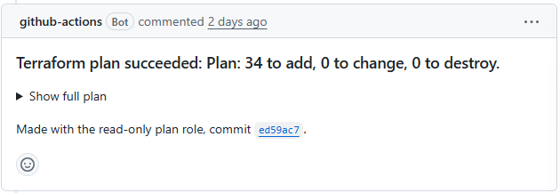
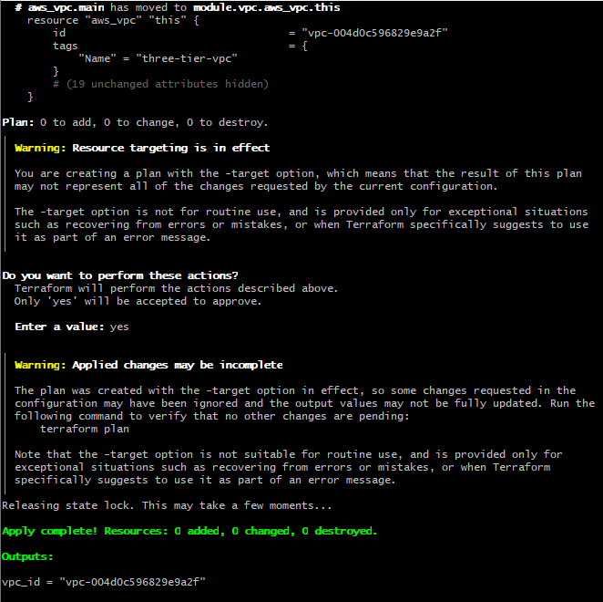

# Splitting main.tf and moving the VPC into a module

The short version is in the [README](README.md#code-layout-and-the-vpc-module). This is the full story.

Everything used to be in one `main.tf`, about 830 lines. Finding anything meant scrolling. So I split it up, and then pulled the VPC out into its own module.

```
├── network.tf          # calls the VPC module + the 3 security groups
├── compute.tf          # launch template, ALB, target group, ASG, EC2 role
├── database.tf         # password, secret, DB subnet group, RDS
├── observability.tf    # flow logs, CloudTrail, CloudWatch log groups
├── moved.tf            # old address -> new address, one block per resource
├── variables.tf / outputs.tf / provider.tf
└── modules/vpc/
    ├── main.tf         # VPC, subnets, IGW, NAT, route tables
    ├── variables.tf    # what you pass in (CIDRs, AZs, name prefix)
    ├── outputs.tf      # what comes back out (VPC ID, subnet IDs)
    └── README.md
```

**Splitting the file changed nothing.** Terraform reads every `.tf` file in a folder as if it's one file, so which file a resource sits in doesn't matter to it. I still checked. Built only the free parts first (VPC, subnets, IGW, route tables, security groups), ran `terraform plan` before and after the split and diffed the two outputs.

They didn't match at first. The `user_data` block showed up as different. Turned out Git on Windows had saved the old `main.tf` with CRLF line endings, and my new files had LF. Same script, but the invisible characters at the end of each line were different, so the base64 Terraform sends to AWS was different too. I decoded both and compared the MD5 to be sure the script itself hadn't changed.

Why it mattered: on a team where some people use Windows and some use Mac or Linux, every plan would show changes that aren't real. Once people get used to plans with fake changes in them, they stop reading plans properly, and that's how a real change gets through. So I added a `.gitattributes` that forces LF on `.tf`, `.tfvars` and `.yml` files. That fixes it for anyone who clones the repo, not just my laptop. After that the two plans were identical.

**The module part is where things can actually break.** Moving a resource into a module changes its address, `aws_vpc.main` becomes `module.vpc.aws_vpc.this`. Without telling Terraform, it thinks the old one got deleted and a new one got added, so it destroys the VPC and builds a new one. I didn't want that.

So `moved.tf` has one `moved` block per resource, old address to new. The plan on the pull request came back with 12 "has moved" lines and 0 to destroy:



(34 to add is just the stuff I never built for the test, NAT, RDS, EC2 and so on. Same number as before the refactor.)

I merged it but rejected the pipeline's apply. A full apply would have built all 34 paid resources just to rename 12 free ones. So I applied only the renames from my laptop, using `-target` to limit it to the VPC resources.

Terraform refused the first time: `Moved resource instances excluded by targeting`. It won't do half a move. If I target only the new addresses, the old ones would still be sitting in state, and the code and state wouldn't match anymore. It needs both ends of every move in the target list, old and new. Added the old addresses and it went through:



0 added, 0 changed, 0 destroyed, and the VPC ID is the same one it had before, `vpc-004d0c596829e9a2f`. `terraform state list` now shows `module.vpc.*`. Then I destroyed the test resources.

Only the VPC is a module. It's the one piece that's the same in any project. The compute, database and logging stuff is specific to this app, so turning them into modules would just be more files for no reuse. Module inputs and outputs are in [modules/vpc/README.md](modules/vpc/README.md).
